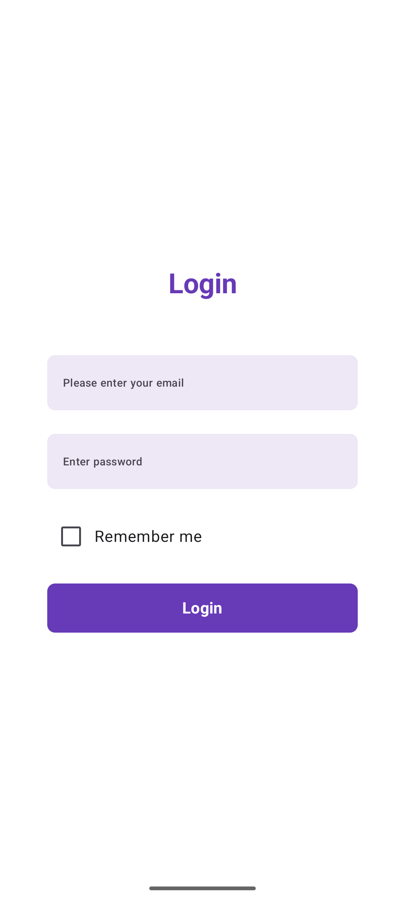
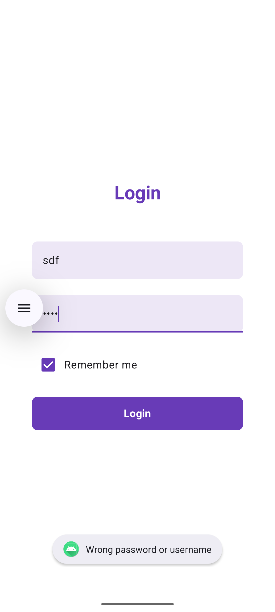
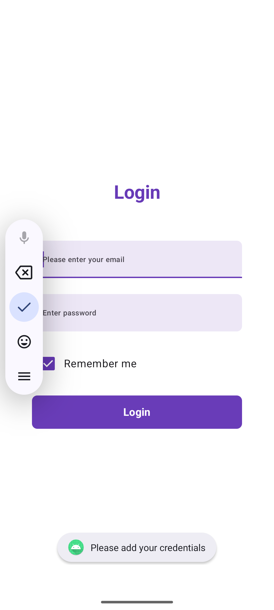
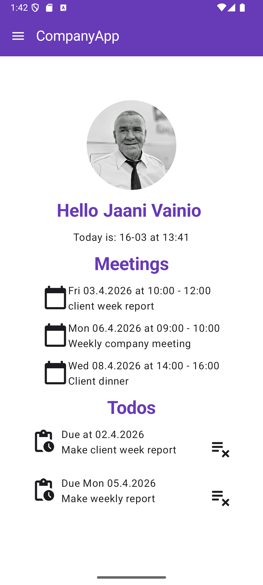
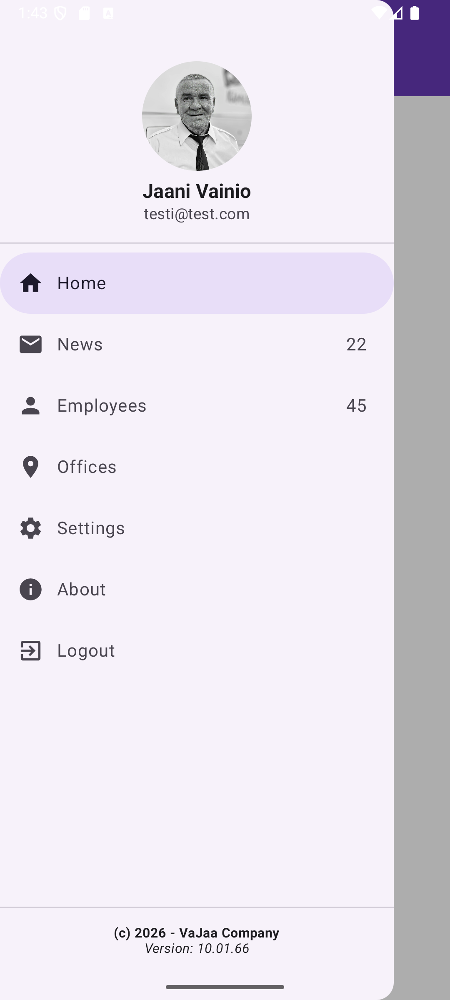
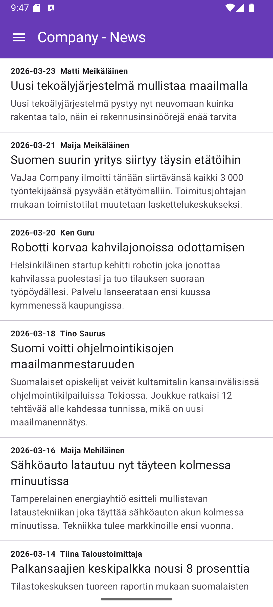
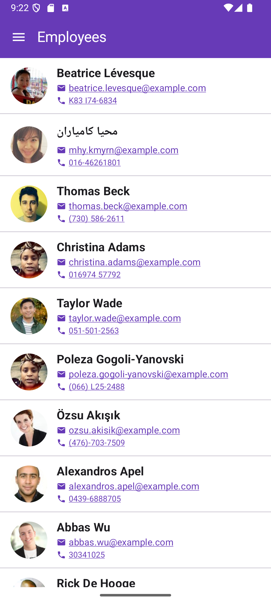
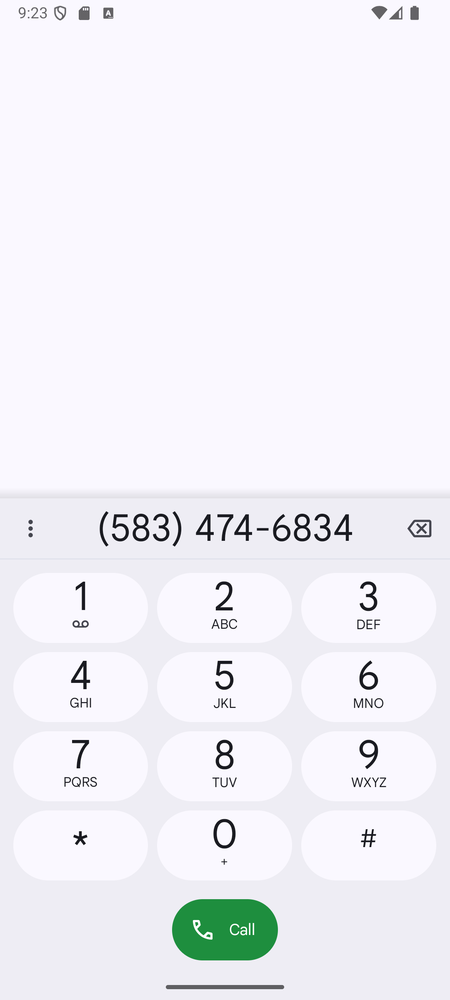

# CompanyApp 📱

CompanyApp is an Android application developed using Kotlin as a final project for an Android development course.

The application simulates an internal intranet system for a fictional company, allowing employees to access company-related information through a modern mobile interface.

---

## 🚀 Features

* 🔐 User authentication (Login screen)
* 🏠 Home dashboard
* 📰 Company news
* 👥 Employee directory

---

## 🛠 Tech Stack

* Kotlin
* Jetpack Compose
* Android SDK

---
## 📸 Screenshots

### 🔐 Login Screen
<p>



</p>
### 🏠 Home Screen




### 📰 News Screen



### 👥 Employees Screen




---

## 📂 Project Structure

```
CompanyApp/
├── app/
├── gradle/
├── screenshots/
├── build.gradle
├── settings.gradle
└── README.md
```

---

## 🎯 Purpose

This project was created as part of an Android development course and serves as a portfolio project demonstrating modern Android development skills using Jetpack Compose.

---

## 📄 License

This project is licensed under the MIT License.
